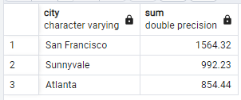
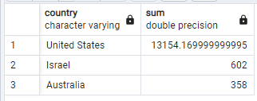

Answer the following questions and provide the SQL queries used to find the answer.

    
**Question 1: Which cities and countries have the highest level of transaction revenues on the site?**


SQL Queries:
```SQL
SELECT city,
		SUM(totaltransactionrevenue)
FROM all_sessions_clean
WHERE totaltransactionrevenue IS NOT NULL AND 
CITY != 'unknown'
GROUP BY city
ORDER BY SUM(totaltransactionrevenue) DESC
LIMIT 3;

SELECT country,
		SUM(totaltransactionrevenue)
FROM all_sessions_clean
WHERE totaltransactionrevenue IS NOT NULL
GROUP BY country
ORDER BY SUM(totaltransactionrevenue) DESC
LIMIT 3;
```

Answer:






**Question 2: What is the average number of products ordered from visitors in each city and country?**


SQL Queries:
```SQL
-- City level data
WITH unit_sales AS (
	SELECT	fullvisitorid,
			city,
			country,
			SUM(units_sold) AS productTotal
	FROM all_sessions_clean AS al
	INNER JOIN analytics_clean AS an USING(fullvisitorid)
	GROUP BY fullvisitorid, city, country
	ORDER BY producttotal DESC
)

SELECT city, ROUND(AVG(producttotal), 2) AS averageunitssold
FROM unit_sales
GROUP BY city
ORDER by city;

-- Country level data
WITH unit_sales AS (
	SELECT	fullvisitorid,
			city,
			country,
			SUM(units_sold) AS productTotal
	FROM all_sessions_clean AS al
	INNER JOIN analytics_clean AS an USING(fullvisitorid)
	GROUP BY fullvisitorid, city, country
	ORDER BY producttotal DESC
)

SELECT country, ROUND(AVG(producttotal), 2) AS averageunitssold
FROM unit_sales
GROUP BY country
ORDER by country;
```

Answer:
The majority of cities had no sales. Among cities with sales, the average ranged from .06 items in Dublin to 136.11 items in San Bruno. San Bruno and Charlotte were outliers significantly higher than all other cities, most of which were under 10 items.

By country, again fewer than half had any sales. The US sold the most number of products, averaging 28.45 items per visitor. The next closest was Czechia with 4.9 items per visitor. 


**Question 3: Is there any pattern in the types (product categories) of products ordered from visitors in each city and country?**


SQL Queries:
```SQL
-- Country level data
WITH sold_categories AS (
	SELECT 	fullvisitorid,
			city,
			country,
			v2productcategory
	FROM all_sessions_clean
	INNER JOIN analytics_clean USING(fullvisitorid)
	WHERE units_sold >= 1
	ORDER BY city, v2productcategory
	)

SELECT 	country,
		v2productcategory,
		COUNT(*)
FROM sold_categories
GROUP BY country, v2productcategory
HAVING COUNT(*) > 3
ORDER BY country, COUNT(*) DESC;

-- City level data
WITH sold_categories AS (
	SELECT 	fullvisitorid,
			city,
			country,
			v2productcategory
	FROM all_sessions_clean
	INNER JOIN analytics_clean USING(fullvisitorid)
	WHERE units_sold >= 1
	ORDER BY city, v2productcategory
	)

SELECT 	city,
		v2productcategory,
		COUNT(*)
FROM sold_categories
GROUP BY city, v2productcategory
HAVING COUNT(*) > 3
ORDER BY city, COUNT(*) DESC;
```
Answer:
For many countries, Apparel was the most ordered category. In Hong Kong, Accesories were the top selling category. Other popular categories include Bags and Notebooks & Journals. The US, having the most sales in general, also had the largest assortment of categories.

At the city level, Apparel again appeared popular in many cities. Electronics also ranked highly particularly among US cities and also Cambridge.


**Question 4: What is the top-selling product from each city/country? Can we find any pattern worthy of noting in the products sold?**


SQL Queries:
```SQL
-- City level
WITH sold_items AS (
	SELECT 	fullvisitorid,
			city,
			country,
			v2productname,
			units_sold
	FROM all_sessions_clean
	INNER JOIN analytics_clean USING(fullvisitorid)
	WHERE units_sold >= 1
	ORDER BY city, v2productname
	),

city_items AS (
	SELECT 	city,
			v2productname,
			SUM(units_sold) AS total_units
	FROM sold_items
	GROUP BY city, v2productname
	HAVING SUM(units_sold) > 3
	ORDER BY city, SUM(units_sold) DESC
	)
	
-- View top selling item in each city.
SELECT *, RANK() OVER(
	PARTITION BY city
	ORDER BY total_units DESC
)
FROM city_items
ORDER BY rank, v2productname

-- Country level
WITH sold_items AS (
	SELECT 	fullvisitorid,
			city,
			country,
			v2productname,
			units_sold
	FROM all_sessions_clean
	INNER JOIN analytics_clean USING(fullvisitorid)
	WHERE units_sold >= 1
	ORDER BY city, v2productname
	),

country_items AS (
	SELECT 	country,
			v2productname,
			SUM(units_sold) AS total_units
	FROM sold_items
	GROUP BY country, v2productname
	HAVING SUM(units_sold) > 3
	ORDER BY country, SUM(units_sold) DESC
	)
	
-- View top selling item in each country.
SELECT *, RANK() OVER(
	PARTITION BY country
	ORDER BY total_units DESC
)
FROM country_items
ORDER BY rank, v2productname
```
Answer:
Many cities' top selling item was a Google branded item. YouTUbe branded items were also popular as well as Nest equipment.

At the country level, Google and YouTube branded items also topped multiple country's sales. By far the most sold item though was Straw Beach Mats in the US.


**Question 5: Can we summarize the impact of revenue generated from each city/country?**

SQL Queries:
```SQL
SELECT city,
		SUM(totaltransactionrevenue)
FROM all_sessions_clean
WHERE totaltransactionrevenue IS NOT NULL AND 
CITY != 'unknown'
GROUP BY city
ORDER BY SUM(totaltransactionrevenue) DESC;

SELECT country,
		SUM(totaltransactionrevenue)
FROM all_sessions_clean
WHERE totaltransactionrevenue IS NOT NULL
GROUP BY country
ORDER BY SUM(totaltransactionrevenue) DESC;
```


Answer:


